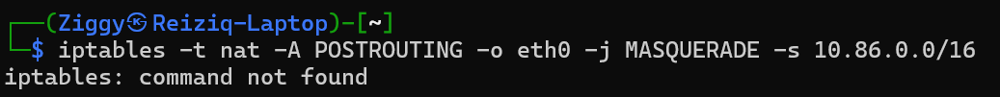

# Laporan Praktikum Modul 1: 

| Nama Lengkap                        | NIM         |
|------------------------------------|-------------|
| M. Hikari Reizqi Rakhmadinta       | 5027241079  |
| MADE GDE KRISNA WANGSA             | 5027201047  |

- **Kelompok**: K-45
- **Prefix IP**: 10.86

Laporan ini mendokumentasikan proses pengerjaan soal 1 hingga 4, mulai dari setup topologi sederhana hingga memberikan akses internet ke semua *node client*.

---

## 1. Setup Awal dan Konektivitas Router
Tahap awal adalah membangun topologi sederhana untuk menghubungkan **Router Eru** ke internet dan memastikan akses konsol dapat dilakukan.

-   **Membuat Topologi Sederhana**
    Topologi awal terdiri dari *node* NAT yang terhubung ke *node* Debian (yang nantinya akan menjadi Router Eru).
    

-   **Instalasi Telnet Client**
    Untuk mengakses konsol GNS3, Telnet client diinstall terlebih dahulu pada WSL.
    

-   **Menguji Akses Konsol**
    Setelah instalasi, koneksi ke konsol *node* di GNS3 berhasil dilakukan.
    

-   **Menguji Koneksi Internet Router (Eru)**
    Dengan mengaktifkan DHCP client pada *interface* yang terhubung ke NAT, Router Eru berhasil mendapatkan koneksi internet, dibuktikan dengan `ping google.com`.
    

---

## 2. Soal 1: Melengkapi Topologi Jaringan
Sesuai soal, topologi kemudian dilengkapi dengan dua *switch* dan empat *client* (Melkor, Manwe, Varda, dan Ulmo).


---

## 3. Soal 2 & 3: Konfigurasi Alamat IP
Selanjutnya, alamat IP statis diatur untuk semua *node* agar dapat berkomunikasi di jaringan lokal.

-   **Eru (Router)**
    ```
    auto eth1
    iface eth1 inet static
        address 10.86.1.1
        netmask 255.255.255.0

    auto eth2
    iface eth2 inet static
        address 10.86.2.1
        netmask 255.255.255.0
    ```

-   **Melkor (Client)**
    ```
    auto eth0
    iface eth0 inet static
        address 10.86.1.2
        netmask 255.255.255.0
        gateway 10.86.1.1
    ```

-   **Manwe (Client)**
    ```
    auto eth0
    iface eth0 inet static
        address 10.86.1.3
        netmask 255.255.255.0
        gateway 10.86.1.1
    ```

-   **Varda (Client)**
    ```
    auto eth0
    iface eth0 inet static
        address 10.86.2.2
        netmask 255.255.255.0
        gateway 10.86.2.1
    ```

-   **Ulmo (Client)**
    ```
    auto eth0
    iface eth0 inet static
        address 10.86.2.3
        netmask 255.255.255.0
        gateway 10.86.2.1
    ```
Pengecekan pada Eru menggunakan `ip a` menunjukkan semua *interface* telah terkonfigurasi dengan benar.


---

## 4. Soal 4: Memberikan Akses Internet untuk Client
Langkah terakhir adalah mengkonfigurasi Eru agar dapat meneruskan koneksi internet ke semua *client*.

-   **Konfigurasi Iptables (NAT)**
    Untuk melakukan NAT, `iptables` perlu diinstall dan dikonfigurasi pada Eru.
    -   Percobaan awal gagal karena `iptables` belum terinstal.
        
    -   Instalasi `iptables` kemudian dilakukan.
        
    -   Aturan NAT `MASQUERADE` berhasil ditambahkan. Pada tahap ini, alamat DNS server (`192.168.122.1`) juga dicatat dari file `/etc/resolv.conf` Eru.
        

-   **Konfigurasi DNS dan Pengujian Akhir pada Client**
    Alamat DNS server yang didapat dari Eru kemudian dikonfigurasikan pada salah satu *client* (contoh: Melkor). Setelah konfigurasi DNS, dilakukan tes `ping google.com` yang akhirnya berhasil. Ini membuktikan bahwa *client* sudah dapat terhubung ke internet melalui Router Eru.
    

---

## 5. Soal 5: Membuat Konfigurasi Persisten
Tujuan dari soal ini adalah untuk memastikan semua konfigurasi jaringan yang telah diatur tidak hilang atau ter-reset setelah setiap *node* di-*restart*.

### Solusi dan Implementasi
Pengerjaan soal ini secara otomatis sudah tercapai pada saat mengerjakan soal 2 dan 3. Konfigurasi jaringan pada sistem operasi Debian menjadi permanen ketika ditulis ke dalam file `/etc/network/interfaces`.

Semua skrip yang telah dibuat, seperti **`soal_2.sh`** dan **`soal_3.sh`**, bertugas untuk menulis atau menambahkan konfigurasi ke file tersebut. Dengan demikian, setiap kali *node* dinyalakan, sistem akan membaca file ini dan menerapkan konfigurasi IP secara otomatis.


Verifikasi dapat dilakukan dengan sederhana, yaitu me-*restart* salah satu *node* (`reboot`) dan memeriksa kembali konfigurasinya (`ip a`) setelah menyala. Konfigurasi akan tetap sama seperti yang telah diatur.


---
## Soal 14: Analisis Serangan Brute Force
> Setelah gagal mengakses FTP, Melkor melancarkan serangan brute force terhadap Manwe. Analisis file capture yang disediakan dan identifikasi upaya brute force Melkor.

### 1. Persiapan dan Eksplorasi File
Langkah pertama adalah mengunduh file yang disediakan dari Google Drive.


File yang diunduh berupa `shortbf.zip`, yang kemudian diekstrak menjadi file capture `shortbf.pcapng`.


Selanjutnya, dilakukan pengecekan pada `nc 10.15.43.32 3401` yang ternyata merupakan portal pertanyaan, di mana jawabannya dapat ditemukan dengan menganalisis file pcap.


---
### 2. Analisis File Capture

#### Pertanyaan 1: Berapa banyak paket yang terekam?
Untuk mengetahui jumlah total paket, digunakan menu **Statistics > Capture File Properties** di Wireshark.

-   **Jawaban**: `500358`

#### Pertanyaan 2: User mana yang berhasil login?
Karena terdapat ratusan ribu percobaan *login* yang gagal dengan pesan "Invalid credentials", cara tercepat untuk menemukan yang berhasil adalah dengan memfilter respons server yang berisi pesan sukses.
-   **Filter Wireshark**: `http contains "Login successful."`

Filter ini berhasil menampilkan satu paket, yang merupakan respons dari server untuk *login* yang berhasil.


Untuk melihat detail *request* dan *response*, digunakan fitur **Follow > HTTP Stream**.
-   Gambar berikut menunjukkan contoh *stream* dari *login* yang **gagal**.
    

-   Dan ini adalah *stream* dari *login* yang **berhasil**, di mana *username* dan *password* yang benar terlihat.
    
-   **Jawaban**: `n1enna:y4v4nn4_k3m3nt4r1`

#### Pertanyaan 3: Di stream mana kredensial ditemukan?
Nomor *stream* dari komunikasi yang berhasil dapat dilihat di bagian bawah jendela "Follow HTTP Stream".

-   **Jawaban**: `41824`

#### Pertanyaan 4: Alat apa yang digunakan untuk brute force?
Informasi alat yang digunakan dapat ditemukan pada *field* `User-Agent` di dalam *header* HTTP *request*.

-   **Jawaban**: `Fuzz Faster U Fool v2.1.0-dev`

---
### Hasil Akhir
Setelah semua pertanyaan dijawab, flag berhasil didapatkan.

**Flag**: `KOMJAR25{Brut3_F0rc3_yPae8nuoTveKw617mpemTVZY8}`


---
## Soal 17: Analisis File Berbahaya pada Halaman Web
> Manwe membuat halaman web di node-nya yang menampilkan gambar cincin agung. Melkor yang melihat web tersebut merasa iri sehingga ia meletakkan file berbahaya agar web tersebut dapat dianggap menyebarkan malware oleh Eru. Analisis file capture untuk menggagalkan rencana Melkor dan menyelamatkan web Manwe.

### 1. Mengekstrak Objek dari Lalu Lintas HTTP
Untuk menemukan file yang ditransfer melalui halaman web, digunakan fitur **Export Objects > HTTP** di Wireshark.


Fitur ini menampilkan daftar semua objek/file yang diunduh atau diunggah melalui protokol HTTP dalam file *capture*. Terlihat ada tiga file yang ditransfer: `ncsi.txt`, `Invoice&MSO-Request.doc`, dan `knr.exe`.


---
### 2. Analisis dan Jawaban
Dengan informasi ini, pertanyaan dari portal `nc` dapat dijawab satu per satu.

#### Pertanyaan 1: Apa nama file mencurigakan pertama?
Setelah mencoba beberapa nama file yang ada, jawaban yang benar teridentifikasi.

-   **Jawaban**: `Invoice&MSO-Request.doc`

#### Pertanyaan 2: Apa nama file mencurigakan kedua?
Berdasarkan sisa file, jawaban yang benar adalah `knr.exe`.

-   **Jawaban**: `knr.exe`

#### Pertanyaan 3: Apa hash dari file mencurigakan kedua (knr.exe)?
Untuk mendapatkan hash, file `knr.exe` diekspor dari Wireshark. Kemudian, perintah `shasum -a 256` dijalankan pada file tersebut untuk menghitung nilai hash SHA256-nya.

-   **Jawaban**: `749e161661290e8a2d190b1a66469744127bc25bf46e5d0c6f2e835f4b92db18`

---
### Hasil Akhir
Setelah semua pertanyaan dijawab dengan benar, flag berhasil didapatkan.


**Flag**: `KOMJAR25{M4ster_4n4lyzer_VMn8SULj96pveFpFJW0cBLPed}`
